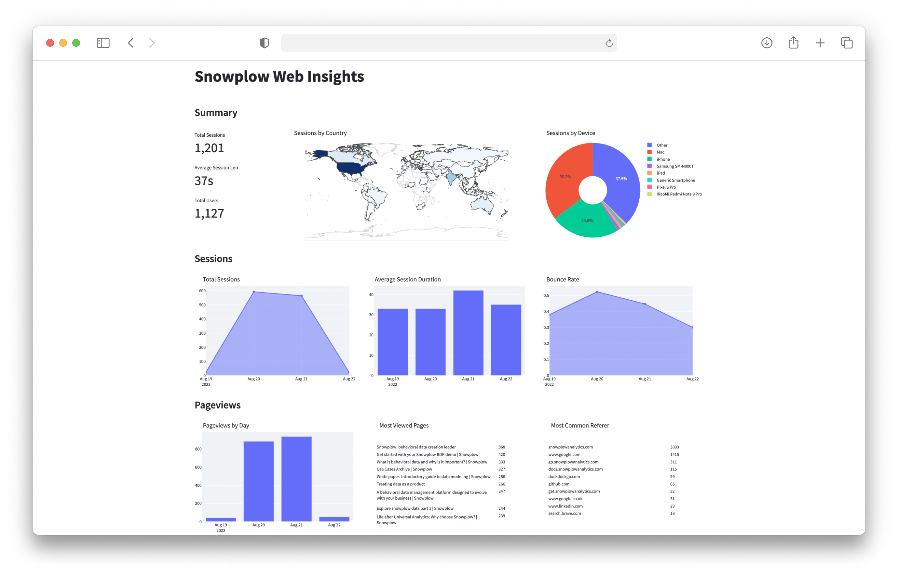

Streamlit uses Python to build shareable dashboards without the need for front-end development experience.

#### **Step 1:** Clone the repository
Run the command below to download the example dashboard:

```bash
git clone --depth 1  --filter=blob:none --sparse https://github.com/snowplow-incubator/snowplow-accelerator-resources.git ; 
cd snowplow-accelerator-resources
git sparse-checkout set advanced-analytics-mobile-accelerator/streamlit
```

Next, move into the streamlit repository

```bash
cd advanced-analytics-mobile-accelerator/streamlit
```

#### **Step 2:** Install requirements
Run the command below to install the project requirements and run the virtual environment.

❗❗ **This implementation has been tested with the following dependencies: *python = 3.9.13, streamlit = 1.18.1, pandas = 1.5.3, pandas-gbq = 0.19.1, plotly = 5.13.0, snowflake-connector-python = 3.0.0, pyarrow = 10.0.1* . If you run into package compatibility issues or encounter any errors try using them to build your own environment.**


```bash
pipenv install
pipenv shell
```

### **Step 3:** Set-up Database Connection
Create a secrets file at `.streamlit/secrets.toml` and add your BigQuery/Databricks/Snowflake connection details.
For BigQuery: make sure you specify your custom `derived` dataset which will be the source schema for the dashboard.

{}
Ensure `secrets.toml` is in `.gitignore` to keep your information safe.
{}

For Snowflake we recommend setting up your credentials in a similar way to your dbt `profile.yml`, as seen [here](https://docs.getdbt.com/reference/warehouse-setups/snowflake-setup#user--password-authentication)

```toml
# .streamlit/secrets.toml

[snowflake]
user = "xxx"
password = "xxx"
account = "xxx"
database = "xxx"
schema = "xxx" # This should point to your derived schema
warehouse = "xxx"
role = "xxx"
```
#### **Step 4:** Run the Streamlit dashboard

Run the command below to run the streamlit locally

```bash
streamlit run Dashboard.py
```

{}
In case the dashboard does not load due to errors such as 'This session does not have a current database. Call 'USE DATABASE', or use a qualified name.' a possible workaround is to assign default ROLE to the Snowflake user that could handle this.
{}


